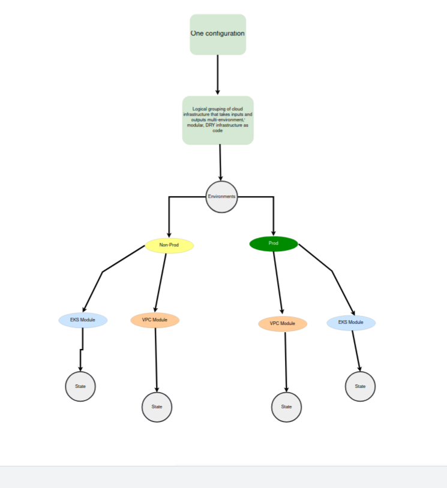

## Instant Infrastructure for Business Growth

### Project Goals

- Provide an easier-to-use alternative for application development teams who want to build infrastructure for their apps to run on.
- Show how this approach could be utilized in businesses from startup to enterprise.

-------

### Skills Required

- **Terraform** AND/OR **TypeScript**
- **AWS**

> **IMPORTANT:** You can do this with teams made up of easy to find skillsets!

-------

These skills are widespread in the industry and work well for companies trying to build productive teams.

This approach significantly reduces the lines of code and complexity needed to deploy infrastructure. You can do this in [Terraform](https://www.terraform.io/) and TypeScript, using [Pulumi](https://www.pulumi.com/). This approach also suits many other tools and languages! I'll build more projects in the future.

--------

### What does the result look like?

